# From Podman AI Lab to OpenShift AI

Forked from https://github.com/redhat-ai-services/podman-ai-lab-to-rhoai  

## Enhancements
* Included Authorino Operator to enable external access to model server with token authentication
* Automated deployment of OpenShift AI and other required components using a shell script. They include:
  * Authorino Operator
  * RHODS Operator
  * Elasticsearch Vector Database
  * S3 Storage (Minio)
  * Service Mesh
  * Serverless
* Provided an option to upload your model from Podman AI Lab to a s3 (minio) bucket for model serving using a shell script
* fixed (Langchain and Elasticsearch Vector Database) Chat Recipe App's 'Connection error' and Langchain API change issues
  

## Overview

Level: Beginner
 
Time: 1 hour
 

A common statement that we've been hearing from customers recently is "I want the ability to chat with my documents". Many customers are aware that Large Language Models (LLMs) provide them the ability to do that, but the implementation details are unknown as well as the possible risks. These unknowns make it difficult to understand where to start. 
 
Thankfully, there is a path forward with the newly released Podman AI Lab extension. Podman AI Lab allows you to pull down models and test them out locally to see how they perform and which one(s) will work best for your use case(s). The chatbot recipe within Podman AI Lab makes integrating LLMs with applications as easy as the click of a button.
  
Podman AI Lab is an excellent place to evaluate and test models, but you'll eventually want to see how this will actually be deployed in your enterprise. For that, we can use OpenShift and OpenShift AI along with the Elasticsearch vector database to create a Retrieval Augmented Generation (RAG) chatbot.
  
This article will walk you through how to go from a chatbot reciepe in the Podman AI Lab extension to a RAG chatbot deployed on OpenShift and OpenShift AI. 

  
## Table of Content
* <a href="#arch">Architecture</a>
* <a href="#req">Prerequisites</a>
* <a href="#podman_ai_lab">Podman AI Lab</a>
* <a href="#deploy_rhoai">Deploy OpenShift AI and Friends</a>
* <a href="#ingest_data">Ingest data into the Elasticsearch Vector Database</a>
* <a href="#upload_model_to_minio">Upload Model to a s3 bucket (Minio)</a>
* <a href="#custom_runtime">Create a Custom Model Serving Runtime</a>
* <a href="#update_chat">Update the Chat Recipe Application</a>

## 
High Level Architecture</a>

<ol>
<li>
A LLM is downloaded through Podman AI Lab.
</li>
<li>
A chatbot recipe is started in Podman AI Lab with the downloaded model.
</li>
<li>
The chatbot recipe code from Podman AI Lab is updated in VS Code with LangChain to connect to the Elasticsearch vector database and OpenShift AI model serving inference endpoint.
</li>
<li>
An ingestion notebook is run in OpenShift AI to add data to the Elasticsearch vector database. 
</li>
<li>
The LLM we downloaded from Podman AI Lab is deployed to OpenShift AI on a custom serving runtime.
</li>
<li>
The updated chatbot with Langchain is built as a container and deployed to OpenShift.
</li>
</ol>

## 
Prerequisites</a>
It is expected that you have admin access to an OpenShift 4.16+ cluster. The follwing code was tested with an OpenShift 4.16 cluster and OpenShift AI (RHODS) 2.13.0.

# 
Podman AI Lab</a>
## Install Podman Desktop and Podman AI Lab extension
Follow the installation instructions for Podman Desktop and the Podman AI Lab extension in the below Red Hat Developer article. The article also gives a great overview of the features in Podman AI Lab. 
https://developers.redhat.com/articles/2024/05/07/podman-ai-lab-getting-started#

## Download the model
We will be downloading and using the TheBloke/Mistral-7B-Instruct-v0.2-GGUF. This model is quantised (smaller) version of the full Mistral-7B-Instruct-v0.2. The smaller model will allow us to run inferencing on CPUs if GPUs are not an option.

<ol>
<li> Go to the AI Lab extension and select Catalog under Models.

</li>
<li> If you haven't already, download the TheBloke/Mistral-7B-Instruct-v0.2-GGUF model

The model is around 4GB so it might take some time.

</li>
<li>
Podman AI Lab allows you to get started quickly with downloaded models through Services, Playgrounds, and the Recipes Catalog. 
<ul>
<li><b>Services</b> 
The Services section allows you to create a model service endpoint for models you've downloaded. Client code is provided (cURL by default) in multiple formats to get you started quickly with sending in requests to the model service endpoint. 

</li>
<li><b>Playgrounds</b> 
The Playgrounds area allows you to define system prompts and experiment with different settings like temperature, max tokens, and top-p.

</li>
<li><b>Recipes Catalog</b> 
The Recipes Catalog contains demo applications for Natural Language Processing (NLP), Computer Vision, and Audio. We'll be using the ChatBot recipe demo code in this example.  
<b>Create the Chatbot</b>
<ol>
<li>
Make sure to select <b><i>TheBloke/Mistral-7B-Instruct-v0.2-GGUF</i></b> as your model and then click <b><i>Start AI App</i></b>

</li>
<li>
After the chatbot has started open it up to test it out.
</li>

<li>
At the bottom of the AI App Details section you'll see a <b><i>Open in VSCode</i></b> button. Clicking on that will open all of the code that is running your chatbot. Later we'll modify that code to connect langchain, TheBloke/Mistral-7B-Instruct-v0.2-GGUF model, and the Elasticsearch Vector Database. 

</li>

</li>
</ol>
</ul>
</li>
</ol>

# 
Deploying OpenShift AI and Friends

<ol>
<li>
Login to your OpenShift cluster in a terminal with the API token. You can get your API token from the OpenShift web console.

<pre>oc login --token=<i>YOUR_OPENSHIFT_API_TOKEN</i> --server=https://<i>YOUR_OPENSHIFT_API_URL</i>:6443</pre>
</li>
<li>
Change to the scripts folder and run the command:
<pre>
./infraSetup.sh
</pre>
It deploys the following:
<ol>
<li>
Authorino Operator
</li>
<li>
RHODS Operator
  <ul>
  <li>a Data Science Cluster</li>
  <li>an ODH Dashboard</li>
  </ul>
</li>

<li>
Elasticsearch Vector Database
  <ul>
  <li>an Elasticsearch Cluster Instance</li>
  <li>displays the connection string and password to the Elasticsearch vector database</li>
  </ul>
</li>

<li>
S3 Storage (Minio)
  <ul>
  <li>displays the Minio Console and API URLs</li>
  </ul>
</li>

<li>
Service Mesh
</li>
<li>
Serverless
  <ul>
  <li>extracts ingress secret</li>
  <li>creates a knative-serving-cert secret using the extracted secret</li>
  <li>enables the Single Model Serving runtime for OpenShift AI</li>
  </ul>
</li>

</ol>
</li>
Yes, it is that simple to set up all the necessary components for this lab.

## Issue and Resolution
Installation of the Service Mesh Operator failed (encountered once):

To diagnose the issue, from the OpenShift console', select 'Operators->Installed Operators->Red Hat OpenShift AI->All Instances'. Identify the failed instance(s). Drill down to the YAML view and check the error message in the status section near the end to see if it says “...client rate limiter Wait returned an error: context deadline exceeded...”. If yes, just wait a few minutes and everything will be OK without manual intervention.

# 
Ingest data into the Elasticsearch Vector Database

 

Now that the Elasticsearch operator has been deployed and an instance created, we can ingest some data and query the vector database.

<ol>
<li>
Go to your OpenShift AI Dashboard. You can get the URL from the infraSetup.sh output.

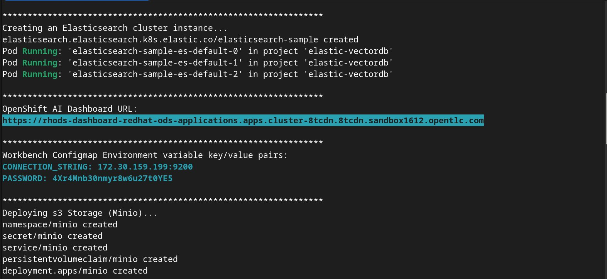

</li>
<li>
Login to the dashboard and select <b>Data Science Projects</b> and click the <b>Create Data Science Project</b> button.

Name the project <i>podman-ai-lab-rag-project</i> and click the <b>Create</b> button.

</li>
<li>
We'll now create a workbench where we can upload a Jupyter notebook to ingest data into the Elasticsearch vector DB. We'll then test it out by querying for some data. Click the <b>Create a workbench</b> button.

Name the workbench <i>elastic-vectordb-workbench</i>, select a <i>Standard Data Science</i> notebook, and select a <i>Medium</i> size.

You'll also want to set two environment variables so we can connect to Elasticsearch from the notebook. 
<ul>
<li>
CONNECTION_STRING - available from the infraSetup.sh output.
Add the CONNECTION_STRING key/value as a ConfigMap environment variable.
  

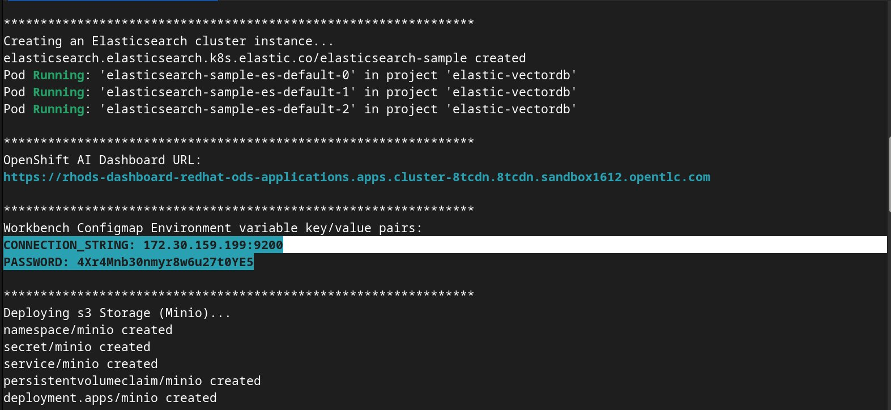
</li>
<li>
PASSWORD - also avaiable from the infraSetup.sh output.
Add the PASSWORD key/value as a Secret environment variable.
</li>
</li>
</ul>
 

Click on the <b>Create Workbench</b> button. Your workbench should start in a few minutes.

</li>
<li>
Open your workbench after it has started and login.
 <b>Note:</b><i> If you have insufficient resources to start a medium container size then stop the workbench and change the workbench to start as a small container size.</i>
  
</li>
<li>
Upload or import the ./notebooks/Langchain-ElasticSearchVector-ingest.ipynb notebook to your workbench.

</li>
<li>
Run the first 3 cells (<i>Shift + Enter in each cell to run</i>). Make sure you can connect to your Elasticsearch cluster.

</li>
<li>
Continue to run through each cell while reading through what is occurring in each one. The <i>Create the index and ingest the documents</i> cell is where all of the websites and pdfs are stored with embeddings into the Elasticsearch vector database.
  
This cell will take a while to run. Good time for a coffee break.

</li>
<li>
After all of the data is stored into our vector database we can directly query it. Run the last 2 cells to make sure the data was stored successfully and we get back the results we expect.

</li>

</ol>
 

# 
Upload Model to a s3 Bucket (Minio)

OpenShift AI model serving has a dependency on s3 storage. We'll deploy Minio for this tutorial, but any s3 compatible storage should work. For an enterprise s3 storage solution consider <a href="https://www.redhat.com/en/technologies/cloud-computing/openshift-data-foundation">OpenShift Data Foundation</a>.

There are 2 ways to upload a Podman AI Lab model to Minio:
1. Using the Minio Web Console
2. Using the uploadModel.sh shell script
  
## Option 1: Using the Minio Web Console

<ol>
<li>
Login to the Minio UI. You can find the route in the output of the infraSetup.sh.

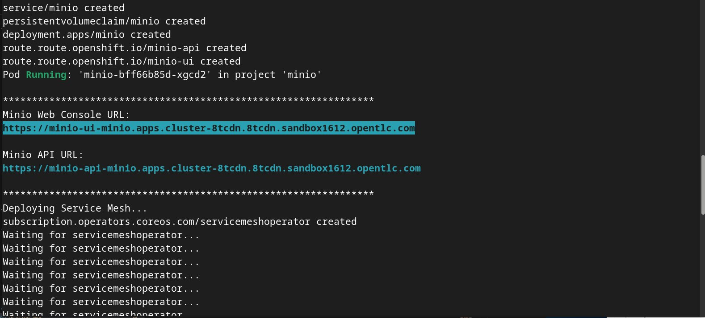

Minio contains 2 routes, an API route and Web Console route.  

Login using the Web Consoe route with <i>minio/minio123</i>. 

</li>
<li>
Create a bucket named <i>models</i> and click the <b>Create Bucket</b> button.

</li>
<li>
Go to <b>Object Browser</b>, select the <i>models</i> bucket you just created, and click the <b>Create new path</b> button. Name the folder path <i>mistral7b</i> and click the <b>Create</b> button.

</li>
<li>
Upload the Mistral7b model to the folder path you just created. You can find out where the model was downloaded if you go back to Podman AI Lab and click the <b>Open Model Folder</b> icon.

In Minio click on the <b>Upload File</b> button and select the model file under the <i>hf.TheBloke.mistral-7b-instruct-v0.2.Q4_K_M</i> directory.

</li>
<li>
If the model is uploaded successfully you should see the below screen.

</li>
</ol>

## Option 2: Using the uploadModel.sh Shell script
Use the Minio Web Console to create a bucket named 'models' and use your favourite editor to change the s3.env (in the scripts folder) file's AWS_S3_ENDPOINT with the Miio API URL shown in the output of infraSetup.sh.  

API endpoint shown in console output:
  
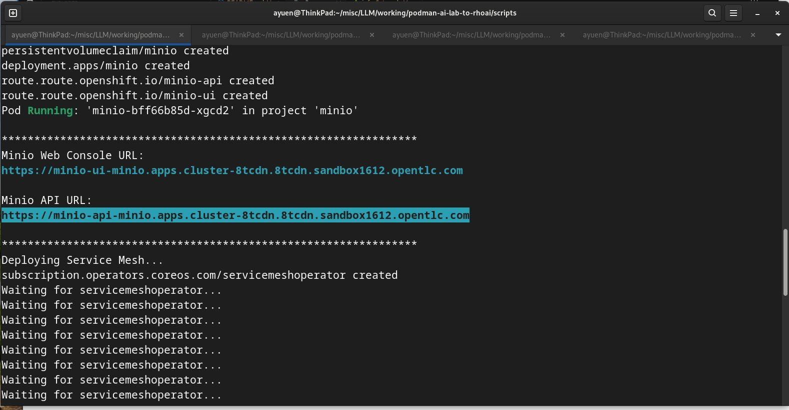
s3.env content after change:

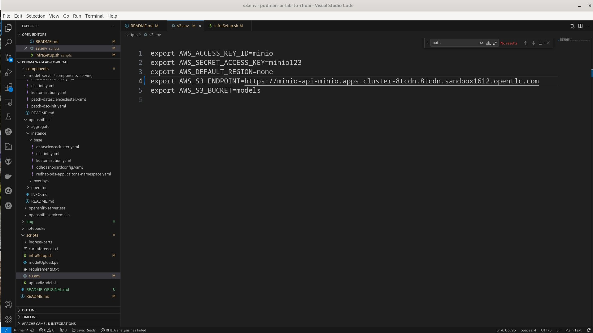

Open a terminal, change to the scripts folder and run the following command:
<pre>
./uploadModel.sh hf.TheBloke.mistral-7b-instruct-v0.2.Q4_K_M mistral7b
</pre>
The model is over 4G and will take a while to upload.
After the upload is done, use the minio Web Console to verify that you have a model in the models bucket.
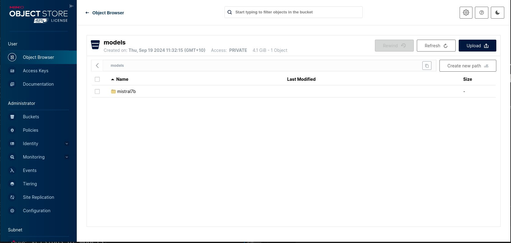

# 
Create a Custom Model Serving Runtime

## Add a Custom Serving Runtime
We'll now add a custom serving runtime so we can deploy the GGUF versions of models.

<ol>
<li>
Click on the <b>Add serving runtime</b> button. 

</li>
<li>
Select <b>Single-model serving platform</b> for the runtime and select <b>REST</b> for the API protocol. Upload the <i>./components/custom-model-serving-runtime/llamacpp-runtime-custom.yaml</i> file as the serving runtime. Click the <b>Create</b> button.

<b>NOTE:</b> <i>A pre-built image available to the public has been specified. You can build your own image with the Containerfile under ./components/ucstom-model-serving-runtime if you would rather pull from your own repository.</i>
</li>
<li>
If the addition of the serving runtime was  succesfully, you should now see it in the list of serving runtimes available. 

</li>
<li>
Go to your <i>podman-ai-lab-rag-project</i> and select <b>Models</b>. You should see two model serving type options. Click on the <b>Deploy model</b> under the Single-model serving platform. 

</li>
<li>
Fill in the following values and click the <b>Deploy</b> button at the bottom of the form.
<ul>
<li>
Model name = <b>mistral7b</b>
</li>
<li>
Serving rutnime = <b>LlamaCPP</b>
</li>
<li>
Model framework = <b>any</b>
</li>
<li>
Model server size = <b>Medium</b>
</li>
<li>
Select <b>New data connection</b>
</li>
<li>
Name = <b>models</b>
</li>
<li>
Access key = <b>minio</b>
</li>
<li>
Secret key = <b>minio123</b>
</li>
<li>
Endpoint = <b>Your Minio API URL</b>
</li>
<li>
Region = <b>us-east-1</b>
</li>
<li>
Bucket = <b>models</b>
</li>
<li>
Path = <b>mistral7b</b>
</li>
</ul>

Note: The old screenshot above is missing the 'Model Route' section just below the 'Model server size'. Instead of redoing that screenshot, I am adding the screenshot below just containing that new section. Make sure the checkboxes are checked, otherwise the model server will only be accessible from within the OpenShift cluster. 
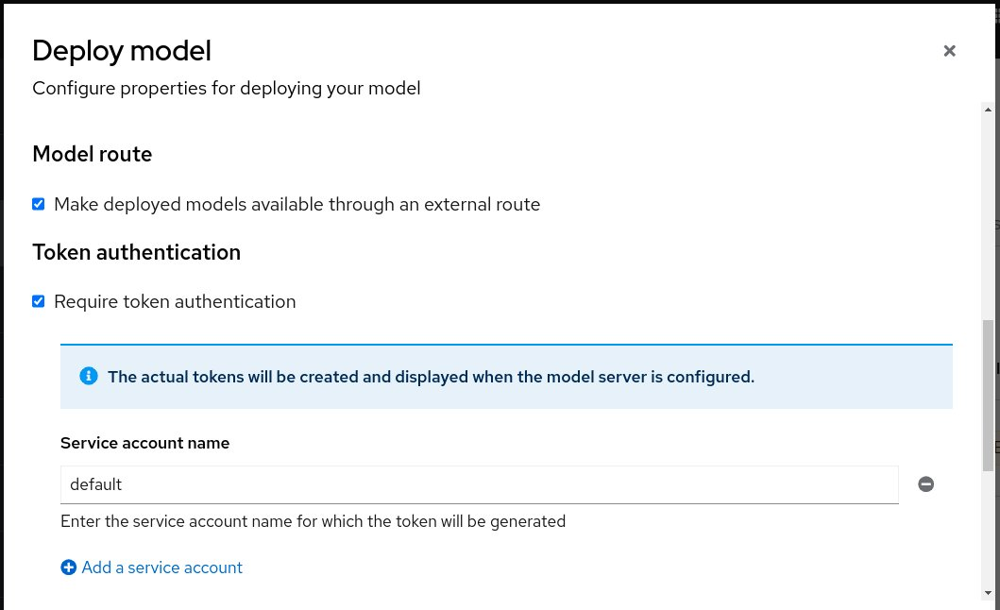

</li>
<li>
If your model deploys successfully you should see the following page.

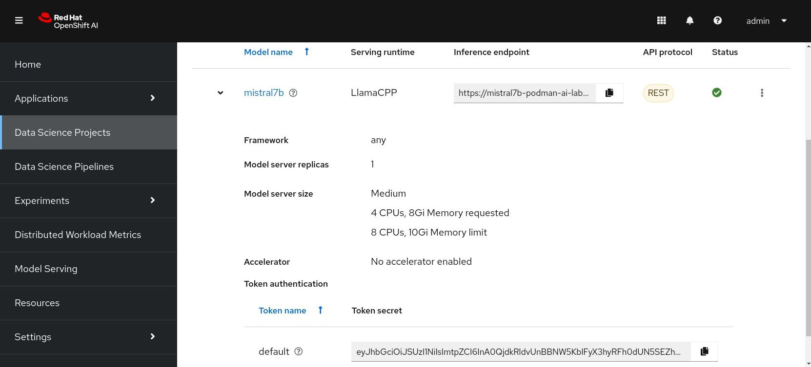

</li>
<li>
Test your model to make sure you can send in a request and get a response. The Inference Endpoint and Token Secret can be retreived from your mistral7b model shown above.

 Make sure to update the TOKEN environment variable with the token secret and the base URL in the cURL command with the Inference endpoint shown in the screenshot.

<pre>
TOKEN='YOUR_TOKEN-SECRET'

curl -k -X POST \
'YOUR_INFERENCE_ENDPOINT/v1/chat/completions' \
-H 'accept: application/json' \
-H 'Content-Type: application/json' \
-H "Authorization: Bearer $TOKEN" \
-d '{
  "messages": [
    {
      "content": "You are a helpful assistant.",
      "role": "system"
    },
    {
      "content": "How large is the capital of France?",
      "role": "user"
    }
  ]
}'  2>/dev/null |  python -m json.tool
</pre>

Your response should be similar to the following:

<pre>
{
    "id": "chatcmpl-520850fe-c3e2-4aac-ad5d-7694c86f1e37",
    "object": "chat.completion",
    "created": 1726868958,
    "model": "/mnt/models/mistral-7b-instruct-v0.2.Q4_K_M.gguf",
    "choices": [
        {
            "index": 0,
            "message": {
                "content": " The size of a city's capital doesn't have a definitive answer as it can be described in various ways such as area (square miles or kilometers), population, or economic output. In this context, let me provide you with some facts about Paris, the capital city of France:\n\n1. Area: Paris covers an area of approximately 105 square kilometers (40.6 square miles).\n2. Population: Paris is home to over 12 million people when counting its metropolitan area. Within its administrative limits, Paris has a population of around 2.1 million residents.\n3. Economy: Paris is the economic powerhouse of France and one of Europe's leading business hubs. Its Gross Domestic Product (GDP) is estimated to be over \u20ac700 billion (US$859 billion), making it a significant global city.\n\nFeel free to ask me about any other topic or question you might have!",
                "role": "assistant"
            },
            "logprobs": null,
            "finish_reason": "stop"
        }
    ],
    "usage": {
        "prompt_tokens": 32,
        "completion_tokens": 206,
        "total_tokens": 238
    }
}

</pre>
</li>
</ol>

# 
Update the Chat Recipe Application

We'll now update the chat recipe application that we created from Podman AI Lab to use Langchain to connect the model we just deployed on OpenShift AI and the Elasticsearch vector database.

<ol>
<li>
We'll start with ./components/app/requirements.txt.

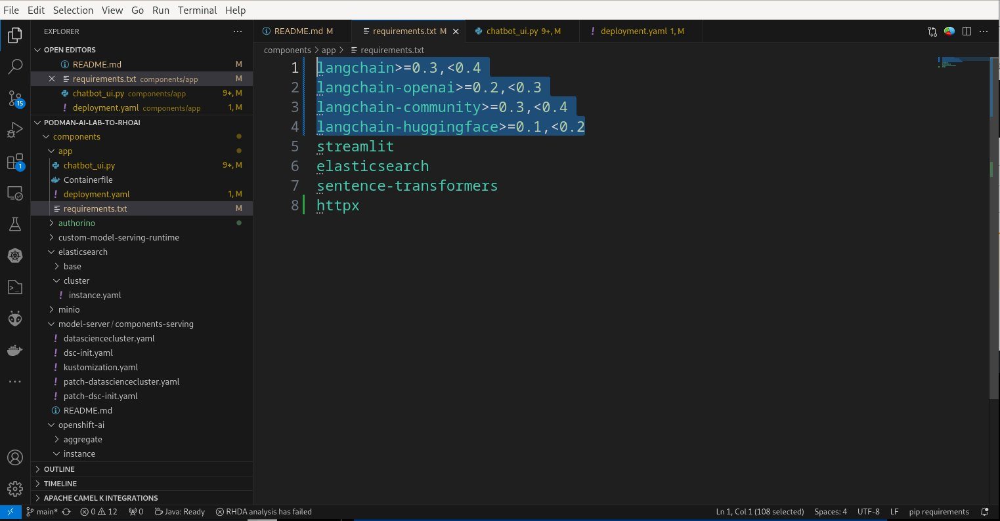

The Langchain API changes a lot from version to version. The newer version may not be backward compatible. We, therefore, added version constraints to the langchain packages. We also added the <b><i>httpx</i></b> package for use in disabling the certs verification when accessing the model server to avoid the 'Connection error' due to use of self-signed certs.
</li>
<li>
Open the ./components/app/chatbot_ui.py file. 
  
<ul>
<li>
Certain Langchain APIs have moved to other packages. We have to change the import statements accordingly.

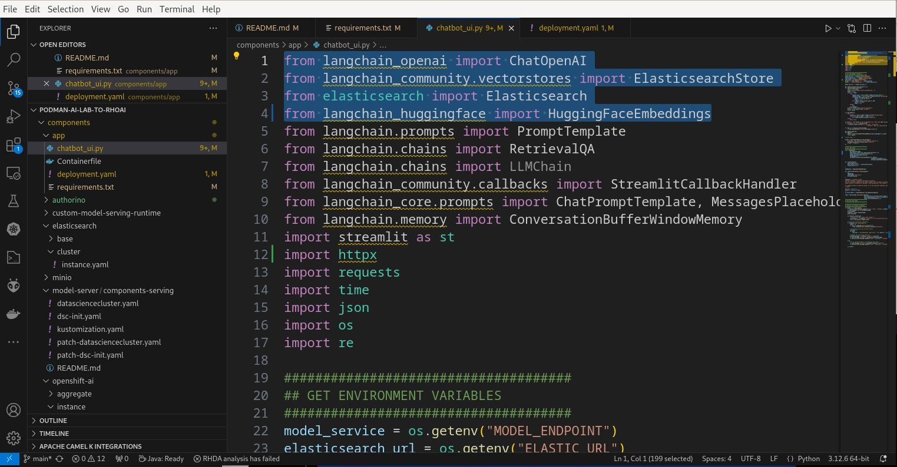

</li>
<li>
We've added an 'AUTH_TOKEN' environment variable since now we are using the Authorino Operator to provide token-based security.

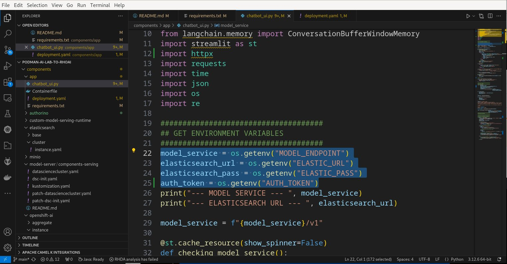

</li><li>
Next, we disable certs verification to avoid the 'Connection error' when accessing the model server which uses self-signed certs and add token authenticaion by changing the ChatOpenAI constructor.

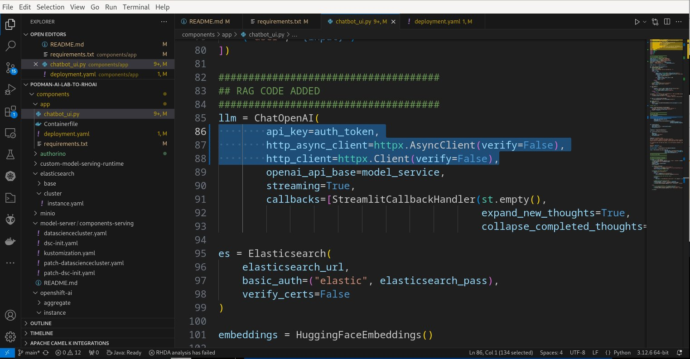

</li>

<li>
You can build your own image using the Containerfile and push it to your own repository or you can use my image:  
<b><i>quay.io/andyyuen/elastic-vectordb-chat:0.5.</i></b>
</li>
<li>
Update the ./components/deployment.yaml file with your values for the MODEL_ENDPOINT, AUTH_TOKEN, ELASTIC_URL, and ELASTIC_PASS environment variables.
  

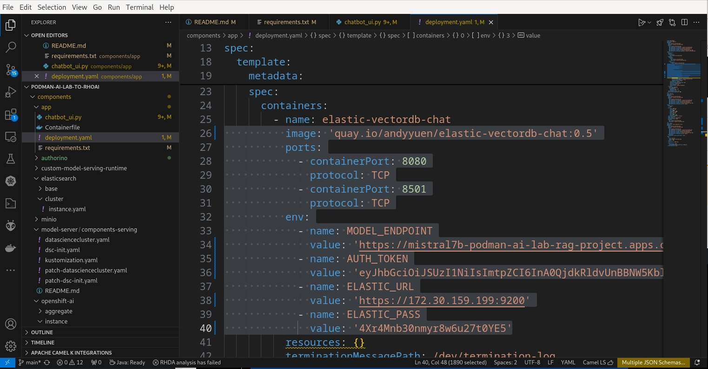

</li>
<li>
Create the project

<pre>oc new-project elastic-vectordb-chat</pre>
</li>
<li>
Apply the deployment.yaml you just updated to deploy the chatbot application.

<pre>
oc apply -f ./components/app/deployment.yaml
</pre>
</li>
<li>
Get the route to the chatbot application

<pre>
oc get route -n elastic-vectordb-chat
</pre>

Open the application in your browser using the route obtained above.

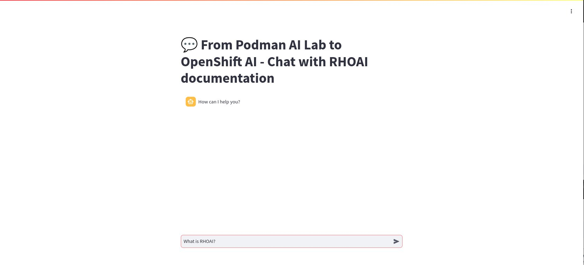

</li>
<li>
Since we have ingested documents related to OpenShift AI, Let's ask an OpenShift AI question. Type "What id OpenShift AI?" and press Enter. It might take a while to respond if the model is deployed in an OpenShift cluster without GPUs. It may even time out the first time you run it. Run it a second time and it will be OK.  
You will see a response similar to that shown below:

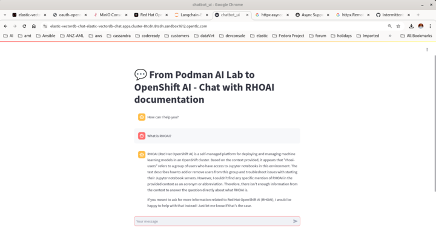

</li>
<li>
In the OpenShift web console you can check the model server logs under the podman-ai-lab-rag-project -> Workloads -> Pods (mistral7b-*) -> Logs. Note the log statements when a message is sent to the model inference endpoint.

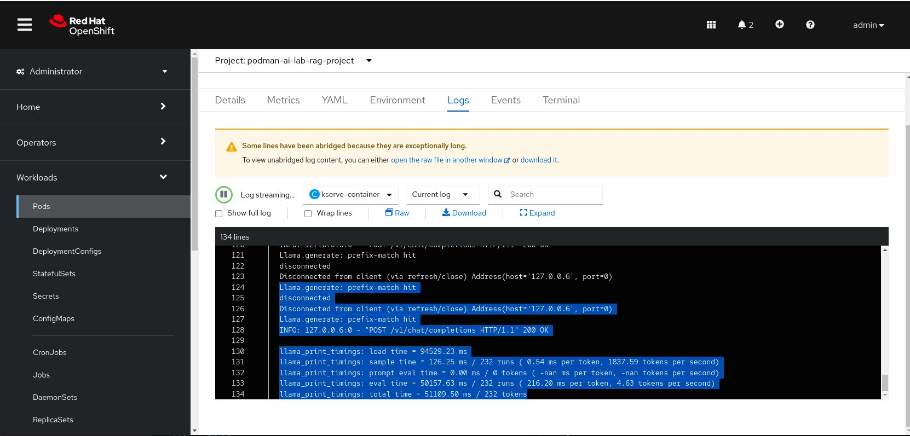

</li>
<li>
Congratulations! You've successfully taken a model and application from Podman AI Lab and created a RAG chatbot deployed on OpenShift and OpenShift AI.
</li>
</ol>
 
<i>I want to give a special thanks to the maintainers of the below repositories. </i>
<ul>
<li>
<i><a href="https://github.com/rh-aiservices-bu/llm-on-openshift">LLM On OpenShift</a> - The notebook to ingest data into Elasticsearch and the Langchain code added to the chatbot app.</i>
</li>
<li>
<i><a href="https://github.com/redhat-ai-services/ai-accelerator">AI Accelerator</a> - The code used to deploy the various components on OpenShift and OpenShift AI.</i>
</li>
</ul>
